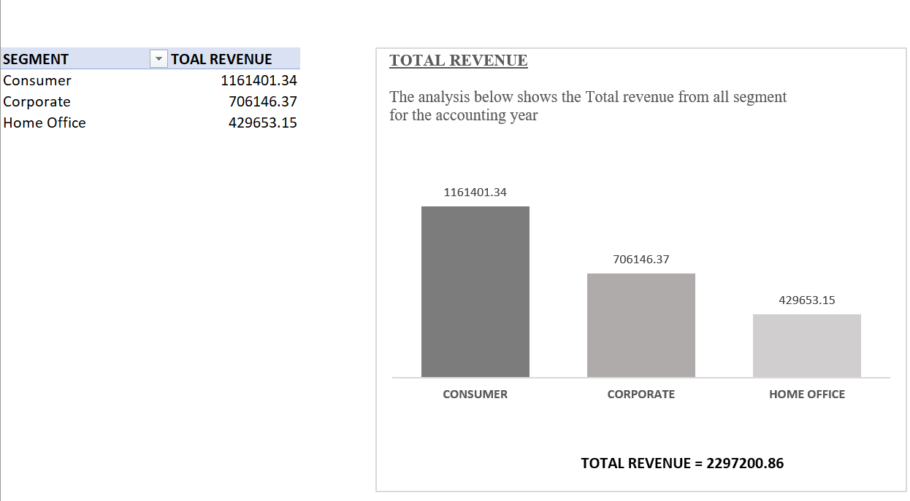
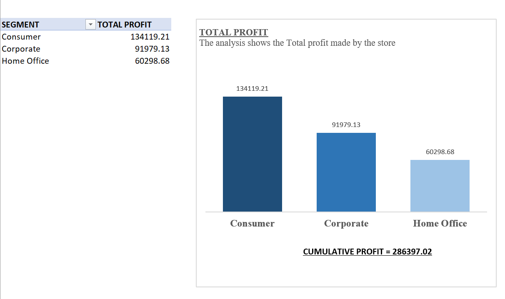
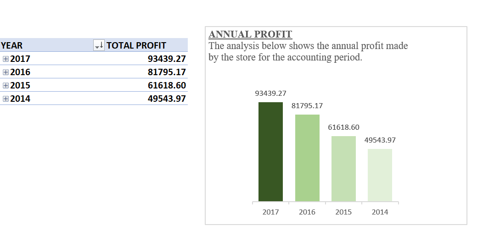
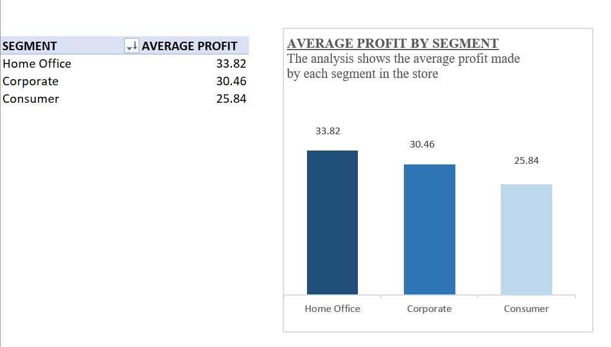
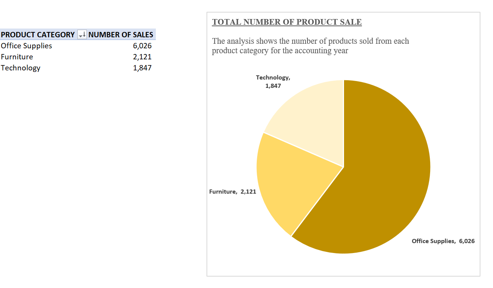
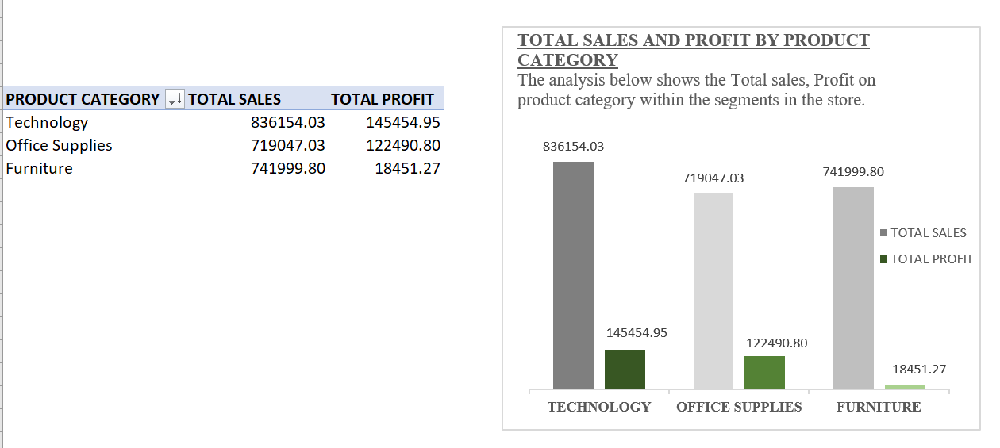
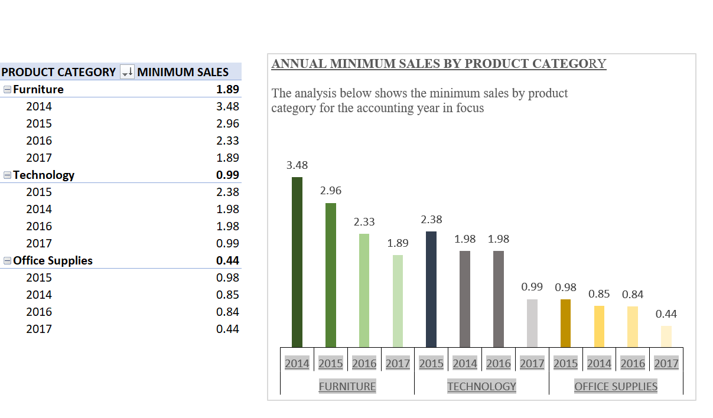

# US-STORE-PROFITABILITY-PERFORMANCE-ASSESSMENT
----

## INTRODUCTION
---

The US-SUPERSTORE analysis is been carried out to ascertain the economic performance of the store in relative to sales, to derive insight into its profitability and product sales performance and as well, the least annual sales within the product category for the years in focus. These data will reveal the most performing segment, product category and assist the management make informed decision on the products they may consider removing from their store due to its low performance and probably invest the money into stocking the performing products. 

**_DISCLAIMER**_:_ All data set and reports do not represent any individual investment, institution or superstore, all data is imaginary and is used for the purpose of practical data analysis practice.

**_Note**_:_ The analysis was carried out using Pivot table analyze for all fields. The specific item of analysis was placed in the required fields present e.g., Filters, Legend, and values, and further adjusted to reflect the unit of analysis required and visualize to give a clearer insight into the data information within.

# Total revenue recorded in the store
----

---
The above analysis presents the total revenue recorded in the sales of products within the store for the accounting period, spread into store segments.
Total profit recorded in the store
The analysis above shows the total profit generated by the sales of products within each segment of the store, this shows the profit performance level of the store.

# Total profit recorded in the store

----

The analysis above shows the total profit generated by the sales of products within each segment of the store, this shows the profit performance level of the store.

# Annual profit
----

---
The analysis above presents the annual profit for the accounting period, from the year 2014 to the year 2017, the annual profit made showed that year 2017 recorded the highest profit and the lowest profit was recorded in the year 2014.

# Average profit.
-----

-----

Using the pivot analyze and the pivot chart, the average profit was recorded in segments within the store, the segments range from Home office, with an average profit of (33.82), Corporate (30.46) and Consumer (25.84)

# Total number of products sold.

-----

The analysis revealed the total number of products sold in the store within the product category, the highest number of sales was recorded in the office supplies category(6,026), followed by Furniture(2,121) and lastly Technology(1,847)

# Total sales and profit by product category
------

-----
The above analysis shows the total sales and profit made by each product category within the store

# The annual minimum sales within the product category
----

-----
The analysis presents the annual minimum sales recorded within the store, this will inform the management decision on the non-performing products to be removed from the catalogue and probably channel the money into stocking the most performing product.

# Conclusion
----
The above assessment shows the financial viability of the superstore, the profitability of the product sales, and the performance of the segments and product category within the store. Though an observation of the product profit performance showed some losses in some products which sold below cost price, effort needs to be made to review the pricing of the products with less than permissible profit performance or be removed from the store and the resources channeled to the most profitable or selling products, rather than tie the finance down in a product with financial losses. This will ensure no losses and increase profiability while maintaining the stores pricing index.

